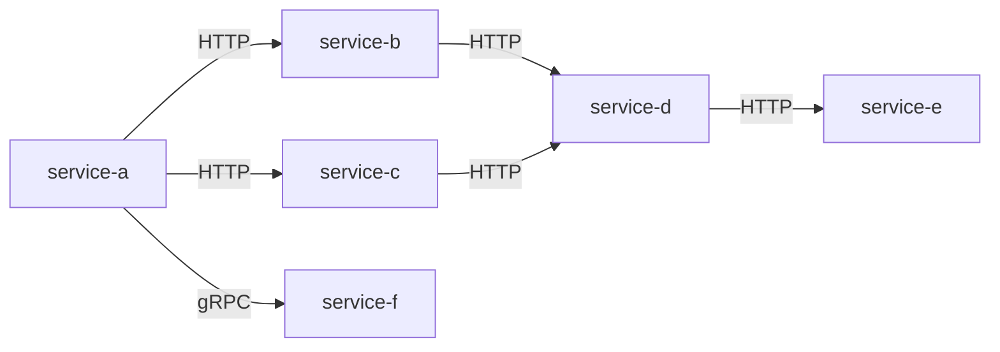

# Sample

## Architecture

```mermaid
flowchart LR
    A[service-a] --> |HTTP| B[service-b];
    B[service-b] --> |HTTP| D[service-d];
    D[service-d] --> |HTTP| E[service-e];
    A[service-a] --> |HTTP| C[service-c];
    C[service-c] --> |HTTP| D[service-d];
    A[service-a] --> |gRPC| F[service-f];
```

## Usage
```bash
sh run.sh
```